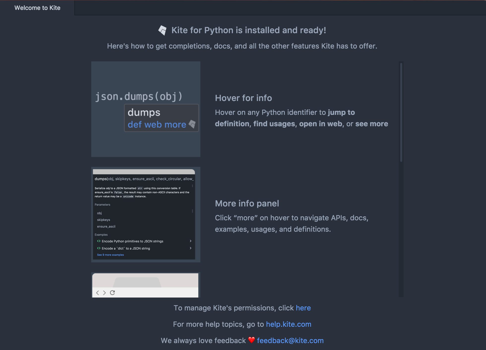
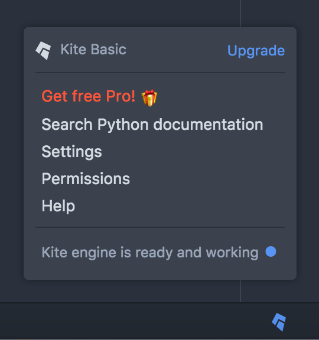
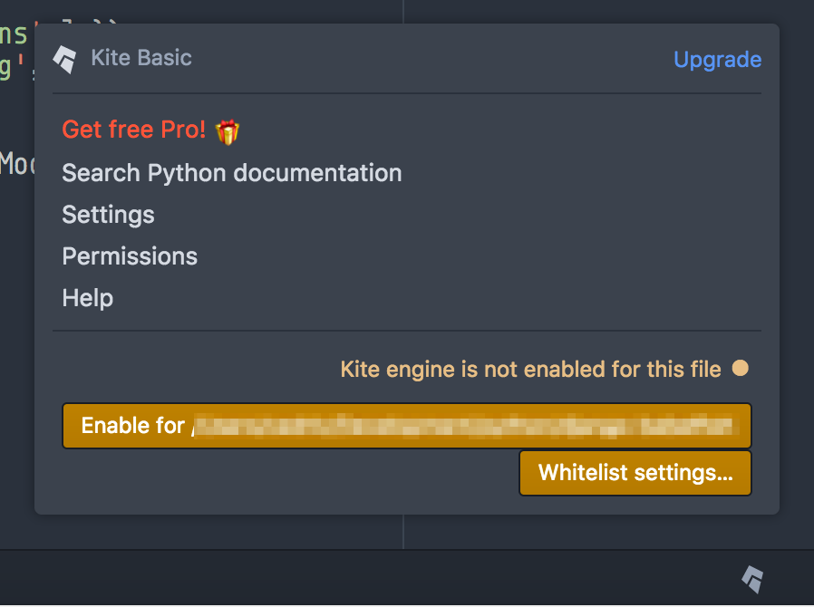
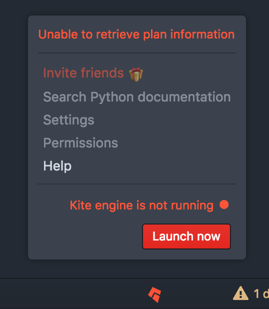
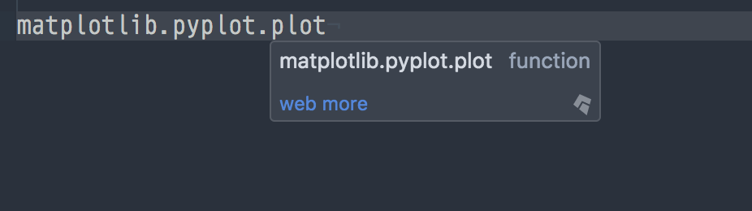
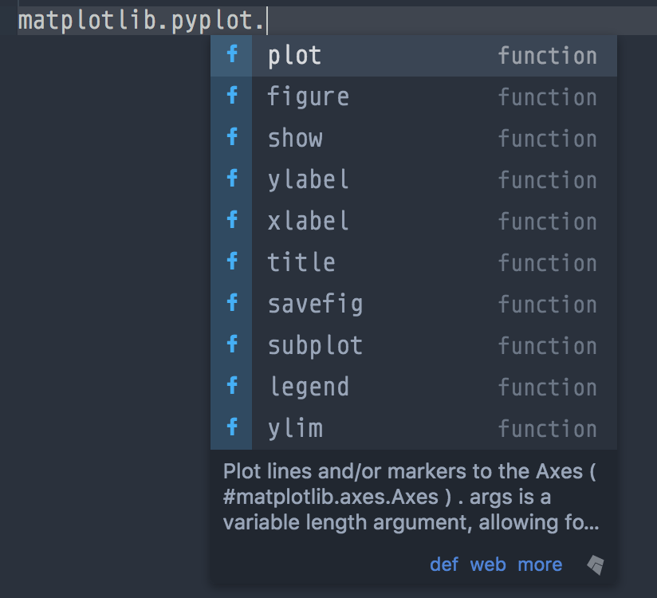
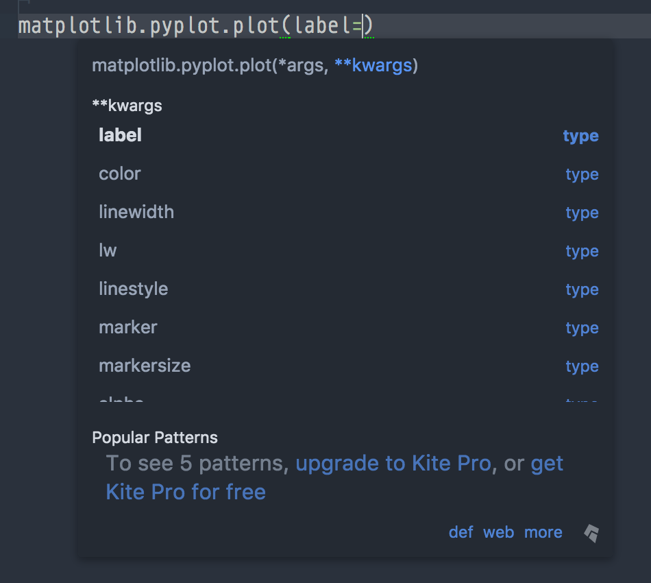
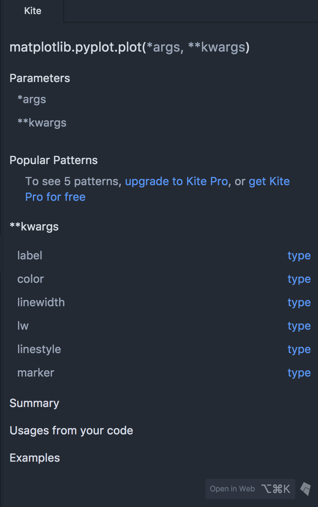
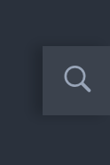
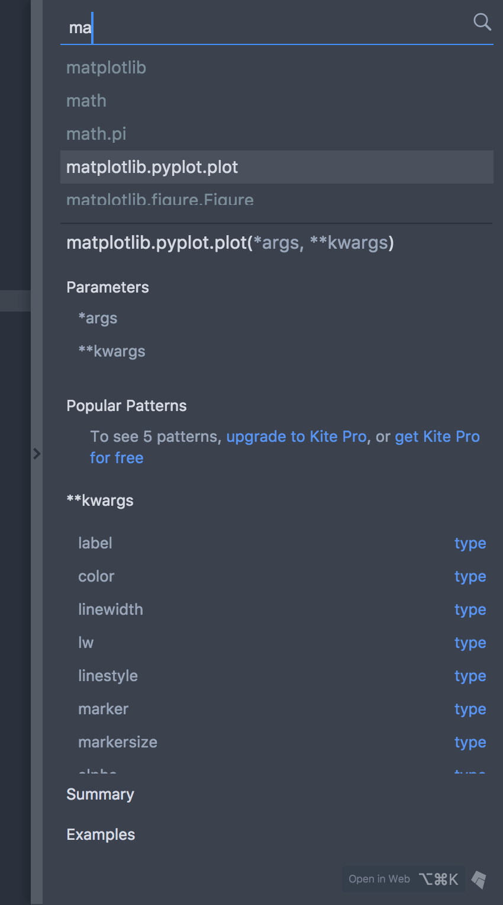

## Atom Kite Plugin Documentation

### Supported Atom versions

All Atom versions greater than or equal to `v1.13.0` are supported.

### Supported operating systems

All OS's supported by Kite are also supported by the Atom plugin, currently it supports:
- OSX (10.10 and higher)
- Windows (7 and higher)

### Supported languages

The plugin's features are only available in file types supported by the Kite engine:

- Python: All files with a `.py` extension are supported.

### Install

You can install the Atom plugin from Kite directly. You can also install the plugin by searching for "Kite" in the package manager or by running `apm install kite` in your terminal.

### Startup

When starting Atom with Kite plugin for the first time, a brief tour about Kite will be displayed in the active pane.

This tour will only be displayed once. If you want to see it again on next startup you can activate the `Show Kite Tour On Startup` setting.

### Status bar

The Kite icon in the status bar displays the state of Kite for the current file. Clicking on the icon will open the status panel with additional information.

The icon in the status bar can take three different colors:

- blue: The Kite Engine is available and functioning properly. 
- gray: There's either no open file or, if there's an active file, the file is either not supported or not whitelisted. 
- red: Something went wrong when the plugin tried to contact the Kite service on your computer. Depending on the issue, the status panel can offer actions to solve the problem. 

### Editor features

#### Hover info

When you move the mouse over an expression, Kite can display a popup with a quick summary of what this expression represents, and links to additional documentation.

You can see up to three links in the popup:

- `def` will open the file where this symbol is defined (this may not be available if Kite cannot find the definition)
- `web` will open the symbol documentation page in your browser
- `more` will open the [Kite sidebar panel](#sidebar-panel) with additional documentation for this symbol

#### Completions

Kite exposes an `autocomplete-plus` provider. When in a supported file, you'll be able to see Kite's suggestions as well as some additional documentation and links in the `autocomplete-plus` panel.

The links at the bottom have the same behaviour of those in the [hover UI](#hover-documentation).

#### Function signatures

When typing inside a function's parentheses, Kite will display the function signature with info about the current argument and links to additional documentation.

The links at the bottom have the same behavior of those in the [hover popup](#hover-info).

#### Sidebar

Kite sidebar offers more detailed docs. You can use the sidebar to browse the members of a module or a type, to access curated examples, and more.

#### Search

When working in a supported file, this small overlay will be displayed at the bottom right of the workspace.

Clicking on it will expand Kite search panel. It allows you to search for identifiers from 3rd party packages or your local codebase.

### Commands

Kite exposes many commands so that you can setup your own keybindings for them.

|Command|Description|
|---|---|
|`kite:search`|Expand the search panel.|
|`kite:docs-at-cursor`|When the cursor is inside an expression, this command will open the sidebar with relevant docs.|
|`kite:open-permissions`|Opens Kite permissions into your browser.|
|`kite:open-settings`|Opens Kite settings into your browser.|
|`kite:open-sidebar`|Opens Kite sidebar.|
|`kite:close-sidebar`|Closes Kite sidebar.|
|`kite:toggle-sidebar`|Toggle Kite sidebar panel (this will close the panel if it was open, or vice versa).|
