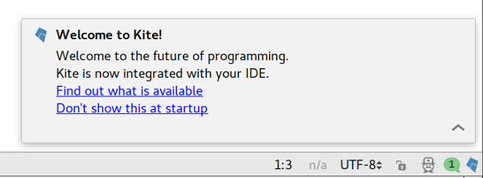
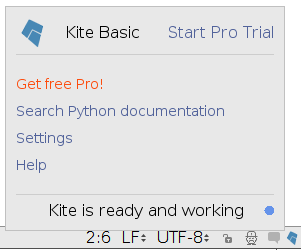
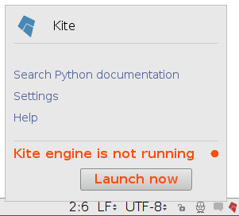
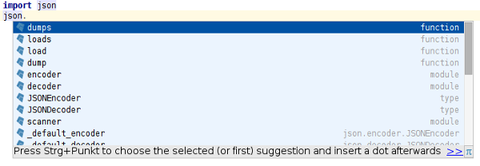

# Handbook

## Supported platforms

The Kite plugin supports the following environments:
- PyCharm Community
- PyCharm Professional
- IntelliJ Community with the Python plugin
- IntelliJ Ultimate with the Plugin plugin

All versions of these IDEs which are equal to or later than 2016.1 are supported:
- 2017.3 EAP
- 2017.2
- 2017.1
- 2016.3
- 2016.2
- 2016.1

## Supported languages

The plugin’s features are only available in file types supported by the Kite engine:
- Python. Support is only available with PyCharm or if the official Python plugin is enabled.

## Startup

When you start your IDE for the first time after the Kite plugin was installed you will
see a notification message.

Click on `Don't show this at startup` to disable the message when your IDE starts.

## Statusbar
This is the Kite icon in the lower right corner which displays the current status of the Kite integration.

States:
  - Blue (or white in Darcula mode) -- The Kite Engine is available and functioning properly.
  - Gray -- The Kite Engine is unavailable because there’s either no file opened or the current file is unsupported.
  - Red -- The Kite Engine is unavailable or there was an error during the last interaction with the engine.

Click on the icon to see more details about the current status of the Kite Engine and details about your Kite account.

## Working with files
The Kite plugin changes several features of your IDE.
The changes are only applied in file types supported by Kite (currently Python only). If you’re working in a Python file then you will see the modified user interface. If you’re working in HTML files, for example, you will continue to see the traditional user interface of PyCharm/IntelliJ.

### Code completion
The plugin offers Kite’s code completions in the editor. Kite’s completions are inserted at the beginning of the list of completions; completions which were returned by PyCharm/IntelliJ will be listed after Kite’s suggestions. Duplicate items are removed.
Kite’s code completion items have a little kite icon in front of it to indicate the source.

If code completion is requested while Kite is not running, PyCharm’s/IntelliJ’s items will be displayed together with a little note below that Kite’s are currently not available.

#### Documentation for autocompletion items
The quick documentation feature is available for Kite’s code completions. To show it, select an item in the code completion menu and then invoke `View -> Quick Documentation`. Alternatively you can use the keyboard shortcut which is shown next to the `Quick Documentation` menu item.

#### Limitations
The Kite plugin returns the same completions for basic and smart-type completions.

At this time the autocompletion is available only while you’re editing a file, i.e. at the place you’re typing. If you call the code completion later on at another location without editing the file then Kite does not return the expected completions at all times. We’re working on full support of this feature.

### Quick documentation
The quick documentation is enhanced by the plugin in files supported by Kite.
Choose `View -> Quick Documentation` to open the documentation popup. This feature uses the standard key binding of your IDE, in most cases this is <kbd>Ctrl + Q</kbd> (or <kbd>Cmd + J</kbd> on Mac OS X).

Use the arrow keys or your mouse to scroll in the content. You can close the popup by pressing <kbd>Esc</kbd>.

If the quick documentation is requested while Kite is not running then PyCharm’s/IntelliJ’s original documentation popup will be displayed.

### Documentation on mouse move
If you enabled the setting `Settings -> Editor -> General -> Show quick documentation on mouse move`, then the popup will show Kite docs. The Kite plugin uses the configured delay of this setting to show the popup after the mouse was moved. IntelliJ’s original popup will not be shown in supported files.

#### Limitations
If the mouse over popup is requested while Kite is not running then a balloon notification will be displayed instead. The original quick doc isn’t shown.

### Parameter info
The Kite plugin enhances the parameter information of your IDE.

If you place the text cursor into a method call and call `View -> Parameter Info` in a file supported by Kite then an
extended popup will be shown. It uses the standard key binding of your IDE, in most cases this is <kbd>Ctrl + P</kbd> (or <kbd>Cmd + P</kbd> on Mac OS X).

The currently active parameter is highlighted as **bold**.

Press <kbd>Tab</kbd> to highlight the next parameter in the panel. Use <kbd>Shift + Tab</kbd> to highlight the previous parameter. If you edit the file or move the text cursor then the
currently highlighted parameter will be updated.

The links in the panel are clickable. Click on the links to see the details of the linked element.

If parameter information is requested while Kite is not running then the original parameter information popup will be displayed instead.

### Whitelisting
The Kite engine’s features are only available in whitelisted directories. If you edit a file which is not whitelisted then a notification
will appear offering to whitelist a directory that contains the file.

To learn more about Whitelisting and privacy check out: http://help.kite.com/article/7-what-files-does-kite-upload-to-their-servers.

  

- *Whitelist `/`*: Click this to whitelist the suggested path on your machine. After a short while code completion and the the other Kite features are going to be available.
- *Browse*: Use this to specify a custom directory which should be whitelisted instead of the suggested path.
- *Settings*: Opens Kite’s [permission settings](kite://settings/permissions) in your browser.
- *Ignore*: Kite will no longer prompt you to whitelist this file in your current working session.

To view and edit your whitelisting settings:
- Click on the Kite icon in the statusbar and then on `Settings` to open Kite’s settings in your browser. Open the tab `Permissions...` to edit your whitelisting settings.
- Visit kite://settings/permissions

## Settings
The Kite plugin offers several settings to customize it. The settings are configured for the application, they apply in all your projects.

Open `File -> Settings... -> Languages & Frameworks -> Kite` to see the configuration options.

Kite allows to set your preferred font sizes for displayed text in the quick documentation panel and the parameter information panel. Because the plugin uses a different rendering engine than the other parts of IntelliJ there might be differences in the size of the rendered text. If no custom font size is configured then Kite applies the font sizes which are used by IntelliJ.

The font settings only apply in file types which are supported by Kite, other file types are not modified in any way.

The font family is not yet configurable. We use suitable values for the different operating systems we support.

- **Quick documentation**
    - **Custom font size**: Set this value to set the font-size of the quick documentation display used by Kite.
- **Parameter Info**
    - **Custom delay for automatic popup**: IntelliJ/PyCharm has a setting to automatically popup the parameter information after a user typed `(` or `,` in a method invocation. The Kite plugin allows you to override the delay of this popup. If the delay is not specified then the value configured in your IDE’s settings will be used instead.
    - **Custom font size**: This settings allows you to override the font-size of the text displayed in the parameter information panel.
- **Mouse over popup**
    - **Custom popup delay on mouse move**: IntelliJ/PyCharm has a setting to automatically show brief information about an element in your editor if you hover your mouse pointer over it. The setting is not enabled in the default configuration. If you enable it then you’re able to override the delay after which the popup will be displayed. You can click on `Configure 'Show quick documentation on mouse move' here` to switch to the settings where this configuration option is shown.
    - **Custom font size**: This font size will be used to render the mouse-over popup which is displayed in file types supported by Kite.

### Configuring Keyboard Shortcuts

The Kite plugin enhances PyCharm’s / IntelliJ’s existing features. It inherits the already configured keyboard shortcuts.

The following actions also apply to Kite’s features, which are available in supoprted files:
- `View -> Quick Documentation`
- `View -> Parameter Info`

## FAQ

### Is the plugin installed in my IDE?
Please open the settings dialog (`File -> Settings...`), choose `Plugins` and check whether there is an item called `Kite` in the list of installed plugins.

### How can I find out whether the Kite plugin is working properly or not?
Please make sure that the plugin is installed (see above).
If the plugin is installed please make sure that the Kite engine is running. If the connection between the plugin and the kite engine is working properly then you will see a little blue Kite icon in the status bar.

If the connection is working properly and if no error or warning is shown in the status panel, then please make sure that the file you’re editing is supported by the Kite engine. Only Python files are supported at the moment.

If you use IntelliJ and not PyCharm then Kite can only offer its extended suport for Python if JetBrains’ Python plugin is installed and activated. Please open `File -> Settings...`, click on `Plugin` in the list on the left and then search for `Python` in the list of installed plugins and make sure that it is enabled. If there is no Python plugin in the list then you can install it by clicking on `Install JetBrains plugin...`.

### Why does nothing happen when I edit a Python file?
First, make sure that the  plugin is working properly (see above).
If the plugin is correctly installed then it is possible that the Kite engine is not returning the data you expected for the current file. You can test to make sure that the Kite engine is working by typing `import json`, you should see Kite completions as you type (they have a little kite icon next to them) and documentation when you select `json` and click `View -> Quick Documentation`.
If the plugin is not working as you expected then please submit an error report to feedback@kite.com.
