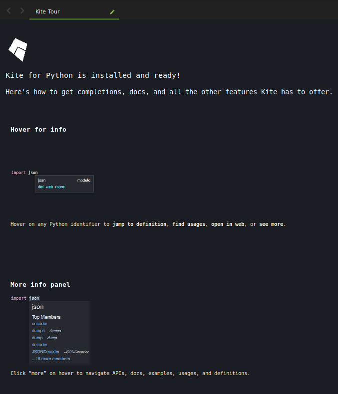
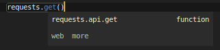

# Sublime Text 3 Kite Plugin Documentation

This is a brief documentation about Sublime Text 3 Kite Plugin

## Supported Sublime Text Versions

The plugin supports any Sublime Text build equal or higher than 3000 but some features require specific version. That
means that if your Sublime Text build is lowe than the needed one for a given feature, that feature will remain
disabled, you can find a table of required versions by feature below.

### Table of required Sublime Text build by feature

In ordet to use all of any of the Kite features your Sublime Text version must be equal or better than the ones
specified in this table.

| Feature | Minimum ST build |
| ---     |             ---: |
| Autocompletion | >= **3000** |
| Sidebar Sync | >= **3000** |
| Popups | >= **3070** |
| Hover | >= **3124** |
| Extended Panel (*deprecated*) | >= **3124** |
| Status Panel (*deprecated*) | >= **3124** |

## Supported Operating Systems

Kite's Sublime Text 3 plugin officially supports all Operating Systems being already supported by Kite itself, currently:

* macOS (10.10 and higher)
* Windows (7 and higher)
* GNU/Linux (experiemntal builds)

## Supported Languages

Sublime Text 3 Kite plugin support any language already supported by Kite engine, curently:

* Python: All files that Sublime Text 3 highlight as Python code will be supported

# Installation

The plugin will be automatically installed by Kite if you active it directly in Kite settings.

# Startup

When starting Sublime Text 3 Kite plugin for the first time, the Kite's tour will be displayed in the active view

This tour will be displayed once, if you want to see it again on next startup you can activate it setting the
`show_kite_tour_at_startup` option as `true` in `Kite.sublime-settings` in your User settings.

# Status Bar

Kite displays it's current status (with a delay of one second max) in the Sublime Text 3 status bar.

The message in the status bar will change displaying different information about the current plugin/Kite status.

# Working with source code

The Kite plugin modifies or enhances several features of your Sublime Text 3 editor, those changes are only visible
while you edit files that are ssupported by the Kite emgine, and they are present in a directory that you whitelisted
and allow Kite to index it's content to be analyzed, so for example, if you are editing a Kite supported source
file, you will get a Kite enriched autocompletion selection box like the one shown in the image below

## Code completion

When Kite is installed and ready and you are editing files in a whitelisted directory Kite will inject intelligent auto completion results into your regular Sublime Text 3 auto completion dialog, Kite completion items specifies thir kind
in the rigth hand side of the completion dialog items.

## Mouse Hover

While navigating code, Kite will detect when the mouse if hovering a symbol if there is information that can be
retrieved and displayed for the hovered symbol, Kite will present the popup shown below

Doing click in the `web` link will open your default web browser pointing to a Kite servers web page with additional
and complete information about the symbol. Doing click in the `more` link will hide the popup and show the symbol
expanded panel that is described in the next section.

## Expanded Panel

The expanded panel will offer a much more detailed view of a symbol documentation and properties. You can use the
expanded panel to browse the members of a module or type, or to access curated examples, Stack Overflow topics and
more.
