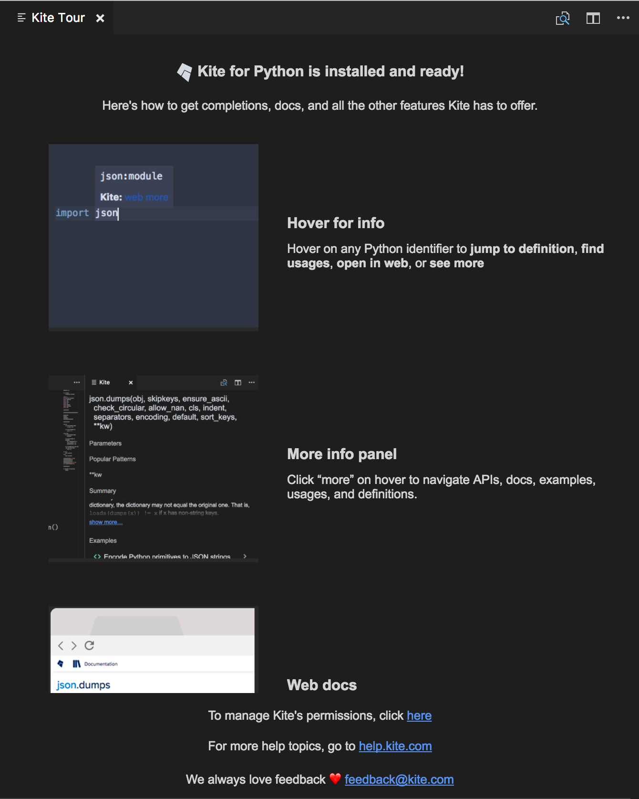
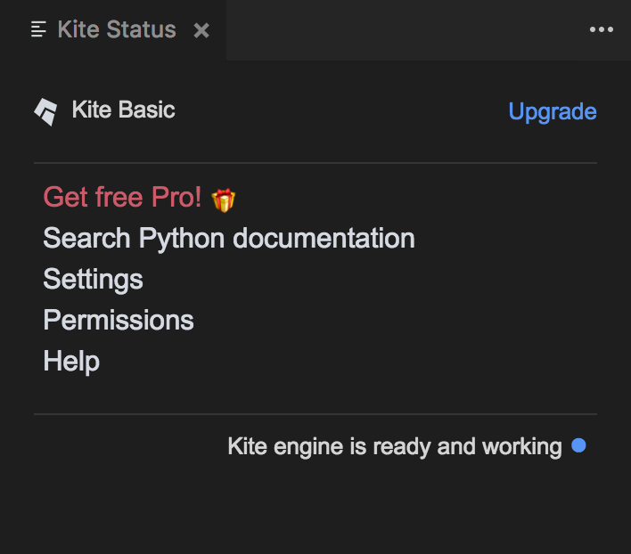
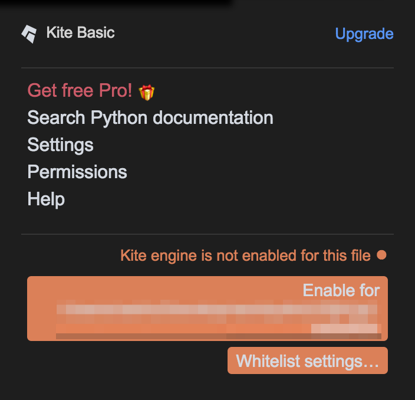
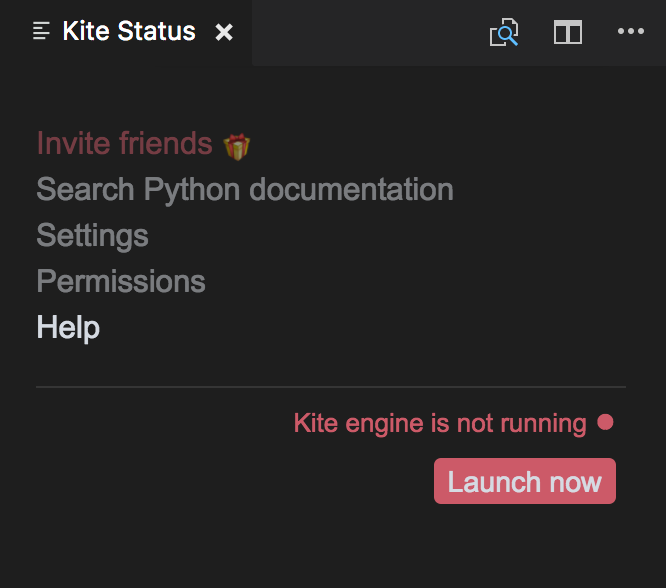
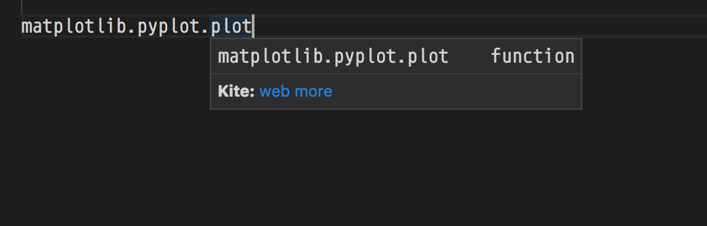
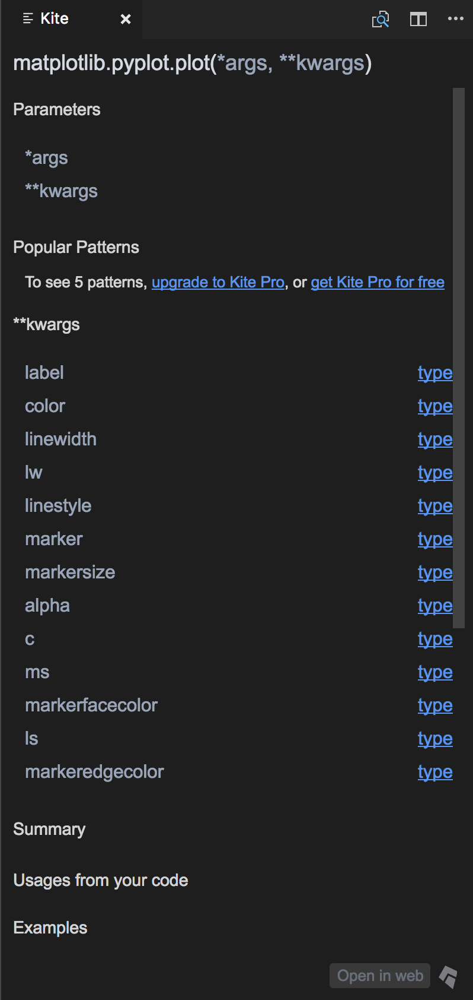
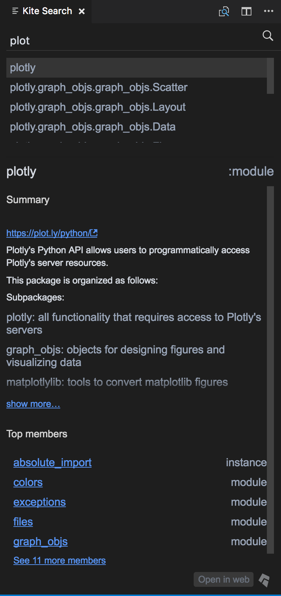

# Kite for Visual Studio Code

*NOTE*: To get up and running with Kite, download Kite at https://kite.com/download.

This extension adds support for Kite in Visual Studio Code and adds the features:

- Completions
- Function Signatures
- Expanded Info
- Goto Definition 

## How to install this extension

This extension is automatically installed by Kite when you select Visual Studio Code in the list of plugins.

### Startup

When starting VSCode with Kite for the first time, a brief tour about Kite will be displayed in the active pane.

This tour will only be displayed once. If you want to see it again on next startup you can activate the `kite.showTourOnStartup` setting.

### Status Bar

The Kite icon in the status bar displays the state of Kite for the current file. Clicking on the icon will open the status panel with additional information.

The icon in the status bar can take three different colors:

- blue: The Kite Engine is available and functioning properly. 
- gray: There's either no open file or, if there's an active file, the file is either not supported or not whitelisted. 
- red: Something went wrong when the plugin tried to contact the Kite service on your computer. Depending on the issue, the status panel can offer actions to solve the problem. 

### Quick Info

Hovering your mouse over a symbol will show you a popup with up to three links:

- `def` will open the file where this symbol is defined (this may not be available if Kite cannot find the definition)
- `web` will open the symbol documentation page in your browser
- `more` will open the [expand view](#expand-view) with additional documentation for this symbol

### Expanded View

The expanded view offers a more detailed view of a symbol. You can use the sidebar panel to browse the members of a module or a type, or to access curated examples, StackOverflow topics, and more.

### Active Search

Active search is available using the corresponding command from the command palette. It will open the search panel on the side.

Type a module, function or symbol name and browse the results in the panel.

### Commands

|Name|Description|
|---|---|
|`Kite Active Search`|Opens the active search panel on the side.|

### Settings

|Name|Description|
|---|---|
|`kite.showTourOnStartup`|Whether or not to show the Kite tour on startup or not.|
|`kite.pollingInterval`|The interval at which the extension checks the status of the Kite connection (defaults to 5s).|
